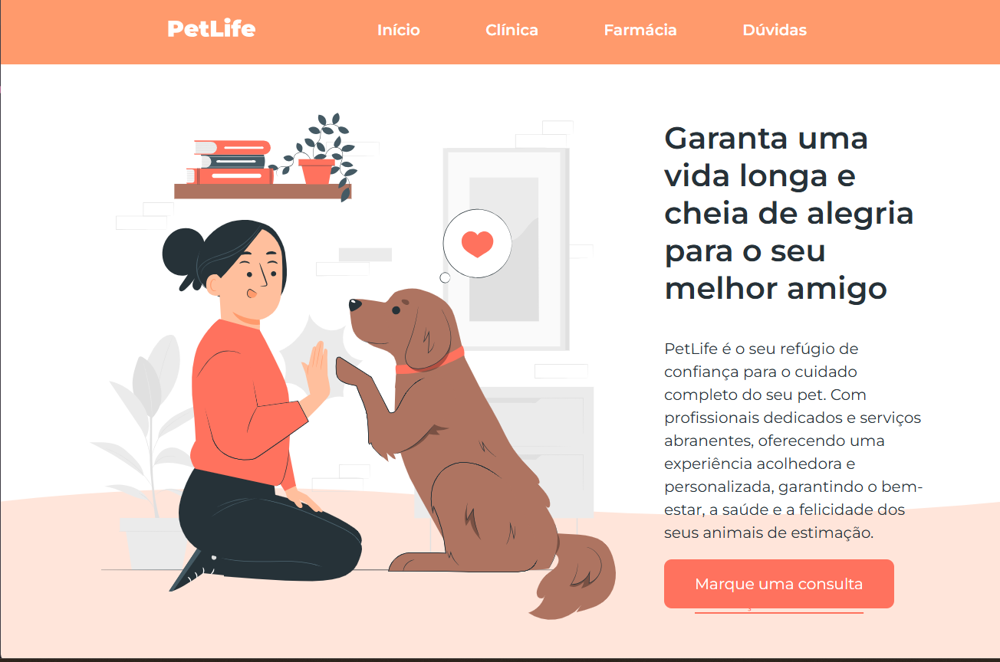

<h1 align="center"> PetLife </h1>

Projeto prático do Minicurso Start na Programação oferecido pela <a href="https://github.com/OneBitCodeBlog">OneBitCode</a>

  <a href="#-tecnologias">Tecnologias</a>&nbsp;&nbsp;&nbsp;|&nbsp;&nbsp;&nbsp;
  <a href="#-projeto">Projeto</a>&nbsp;&nbsp;&nbsp;|&nbsp;&nbsp;&nbsp;
  <a href="#memo-licença">Licença</a>

  

 

  

## 🚀 Tecnologias

Esse projeto foi desenvolvido com as seguintes tecnologias:

- HTML e CSS
- JavaScript
- Git e Github

## 💻 Projeto

O PetLife é uma landing page para apresentar informações sobre a clínica veterinária, seus serviços e contato. O design foca em uma interface limpa e intuitiva.

<a href="https://regianabarbosa.github.io/petlife-webpage/" target="_blank">Veja o projeto finalizado</a>

## 📝 Licença

Esse projeto está sob a licença MIT.